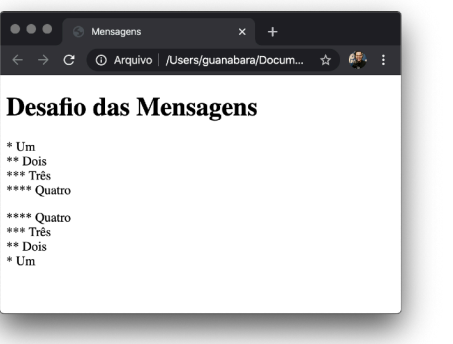

#Desafio 001 Mensagens 
---
Olá, tudo bem? Vamos começar nossos exercícios com algo bem simples: exibir
textos com uma mistura de parágrafos e quebras de linhas.
Você deve criar um código HTML que use apenas parágrafos e quebra de linhas e
que gere o seguinte resultado visual:

IMPORTANTE: Note que a primeira contagem está separada da segunda, isso é
uma característica que vimos ao decorrer do material de exercícios. Nada de usar
vários   na sequência, hein?!